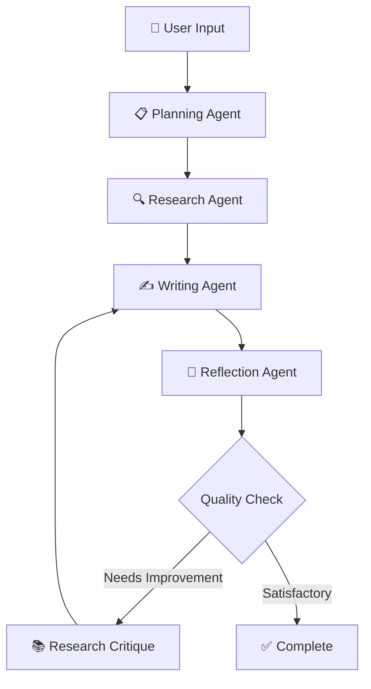

# 🤖 AI Essay Writer

> **Multi-Agent Essay Writing System with Authentication & Persistence**

A sophisticated essay writing application powered by LangGraph multi-agent system, featuring comprehensive authentication, user management, and real-time collaboration capabilities.

[](https://render.com/deploy)
[](https://railway.app/template)
[](https://heroku.com/deploy)

## ✨ Features

### 🤖 **Multi-Agent Essay Writing**
- **Planning Agent**: Analyzes topics and creates comprehensive essay structures
- **Research Agent**: Conducts intelligent web research using Tavily API
- **Writing Agent**: Generates high-quality content using Groq LLM (llama-3.3-70b-versatile)
- **Reflection Agent**: Reviews and provides constructive feedback
- **Critique Agent**: Offers detailed improvements and suggestions
- **State-based Workflow**: Powered by LangGraph for robust execution

### 🔐 **Enterprise Authentication**
- OAuth 2.0 integration with Google and GitHub
- Secure user session management with Flask-Login
- Token storage and automatic refresh
- User isolation and data protection
- HTTPS/SSL support for production

### 💾 **Data Persistence & Management**
- SQLite/PostgreSQL database with SQLAlchemy ORM
- Essay versioning and complete history tracking
- User preferences and personalized settings
- Agent session state management
- Real-time collaboration features

### 🎨 **Professional UI/UX**
- Modern Dash interface with Bootstrap components
- Fully responsive design for all devices
- Real-time agent status and progress updates
- Interactive essay editing and management
- Dark/light theme support

## 🚀 Quick Start

### 1. Clone & Setup
```bash
git clone https://github.com/yourusername/ai-essay-writer.git
cd ai-essay-writer

# Create virtual environment
python -m venv venv
source venv/bin/activate  # Linux/Mac
# venv\Scripts\activate  # Windows

# Install dependencies
pip install -r requirements.txt
```

### 2. Environment Configuration
```bash
# Copy environment template
cp .env.example .env

# Edit .env with your API keys and OAuth credentials
nano .env  # or use your preferred editor
```

### 3. Database Setup
```bash
# Initialize database
python -c "from app import app, db; app.app_context().push(); db.create_all()"
```

### 4. SSL Setup (Development)
```bash
# Generate self-signed certificates
python generate_cert.py
```

### 5. Run Application
```bash
# Development mode
python app.py

# Production mode
gunicorn app:server
```

**Access**: `https://localhost:8050` (with SSL) or `http://localhost:8050`

## 🔧 Configuration

### Required API Keys

| Service | Purpose | Get API Key |
|---------|---------|-------------|
| **Groq** | LLM for essay generation | [Groq Console](https://console.groq.com/) |
| **Tavily** | Web research capabilities | [Tavily Dashboard](https://tavily.com/) |

### OAuth Setup

#### Google OAuth
1. Go to [Google Cloud Console](https://console.cloud.google.com/)
2. Create new project or select existing
3. Enable Google+ API
4. Create OAuth 2.0 credentials
5. Add redirect URI: `https://your-domain.com/login/google/authorized`

#### GitHub OAuth
1. Go to [GitHub Developer Settings](https://github.com/settings/developers)
2. Create new OAuth App
3. Set Homepage: `https://your-domain.com`
4. Set Callback: `https://your-domain.com/login/github/authorized`

## 📁 Project Structure

```
ai-essay-writer/
├── 📄 app.py                    # Main Dash application
├── 📄 requirements.txt          # Python dependencies
├── 📄 .env.example             # Environment template
├── 📄 Procfile                 # Deployment configuration
├── 📄 runtime.txt              # Python version
├── 📄 DEPLOYMENT.md            # Deployment guide
├── 📄 build.sh                 # Build script
│
├── 🔐 auth/
│   └── oauth.py                # OAuth authentication system
│
├── ⚙️ core/
│   └── essay_writer.py         # Enhanced multi-agent system
│
├── 🗄️ database/
│   └── models.py               # SQLAlchemy database models
│
├── 🎨 components/
│   ├── auth_components.py      # Authentication UI
│   └── agent_components.py     # Agent workflow UI
│
├── 🔒 certs/                   # SSL certificates (generated)
├── 📊 instance/                # Database storage
└── 🎯 assets/                  # Static assets
```

## 🤖 Agent Workflow



### Workflow Steps
1. **Planning**: Analyzes topic and creates essay structure
2. **Research**: Gathers relevant information from web sources
3. **Writing**: Generates essay content using AI
4. **Reflection**: Reviews quality and suggests improvements
5. **Iteration**: Refines based on feedback until satisfactory

## 🌐 Deployment

### One-Click Deployment

| Platform | Status | Instructions |
|----------|--------|--------------|
| **Render** | ✅ Ready | Click deploy button above |
| **Railway** | ✅ Ready | Click deploy button above |
| **Heroku** | ✅ Ready | Click deploy button above |
| **Vercel** | ⚠️ Manual | See [DEPLOYMENT.md](DEPLOYMENT.md) |

### Environment Variables for Production

```bash
# Required
GROQ_API_KEY=your_groq_key
TAVILY_API_KEY=your_tavily_key
GOOGLE_CLIENT_ID=your_google_id
GOOGLE_CLIENT_SECRET=your_google_secret
GITHUB_CLIENT_ID=your_github_id
GITHUB_CLIENT_SECRET=your_github_secret
SECRET_KEY=strong_random_string

# Production Settings
DASH_DEBUG=False
OAUTHLIB_INSECURE_TRANSPORT=0
```

## 📱 Screenshots

<details>
<summary>Click to view screenshots</summary>

### Authentication


### Essay Writing Interface


### Agent Workflow


### Essay Management


</details>

## 🔒 Security Features

- ✅ HTTPS/SSL encryption
- ✅ OAuth 2.0 secure authentication
- ✅ Session management with Flask-Login
- ✅ CSRF protection
- ✅ SQL injection prevention
- ✅ Environment variable security
- ✅ User data isolation

## 🧪 Testing

```bash
# Run basic functionality test
python -c "
from app import app, db
from database.models import User, Essay
with app.app_context():
    print('✅ Database connection successful')
    print('✅ Models loaded successfully')
"

# Test API connections
python -c "
import os
from core.essay_writer import EnhancedEssayWriter
writer = EnhancedEssayWriter()
print('✅ Essay writer initialized')
"
```

## 🤝 Contributing

1. Fork the repository
2. Create feature branch: `git checkout -b feature-name`
3. Commit changes: `git commit -am 'Add feature'`
4. Push to branch: `git push origin feature-name`
5. Submit Pull Request

## 📄 License

This project is licensed under the MIT License - see the [LICENSE](LICENSE) file for details.

## 🆘 Support

- 📖 **Documentation**: [Deployment Guide](DEPLOYMENT.md)
- 🐛 **Issues**: [GitHub Issues](https://github.com/yourusername/ai-essay-writer/issues)
- 💬 **Discussions**: [GitHub Discussions](https://github.com/yourusername/ai-essay-writer/discussions)

## 🙏 Acknowledgments

- [LangGraph](https://github.com/langchain-ai/langgraph) for multi-agent orchestration
- [Dash](https://dash.plotly.com/) for the web framework
- [Groq](https://groq.com/) for lightning-fast LLM inference
- [Tavily](https://tavily.com/) for intelligent web research

---

**Made with ❤️ by AI Essay Writer Team**